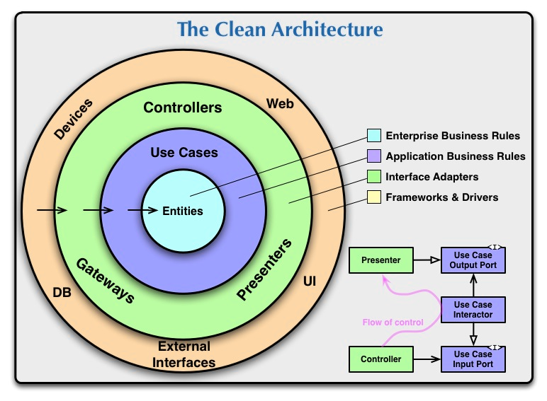

# BloodPressureMeasurementRecordApplet

本系统适用于高血压采集记录，医院对患者基本信息采集、诊断记录、各种检测报告处理等。前后端分离，本系统是这一个项目的后端部分。

## 高血压测量记录小程序后端 基本信息

- [语言]：Golang
- [架构]：传统MVC
- [思想]：清洁架构
- [核心库]：Gin, Gorm, Viper, zap, jwt, uuid, sys, fsnotify, lumberjack.v2
- [平台]：CentOS【腾讯云、阿里云的云服务】
- [数据库]：MySQL
- [测试]：go test(testing模块)
- [开发平台]：Windows10 采用Remote模式开发

### 架构思想
按照依赖注入，面向对象编程思想，开闭原则，可拓展，可测性等原则来规划项目


### 代码结构介绍：
- internal/ 网路接口层，大量调用pkg代码，在这一层中分为model, repo, service, handler, router 逐级向上提供接口，也包括middleware 中间层，在此处编写实际的MVC业务代码
- pkg/ 包代码，包含了整个项目的逻辑架构分层
- tools/ 工具类，均是简单封装直接使用的方法，不需要实例创建
- server/ http&https的路由加载内容，包括自我健康检查
- example/ Gin的标准案例
- tempCode/ 临时代码，主要用于测试，过后删除
- resource/ 资源类，包含资源文件，图片，sql等
- config/ 配置文件，采用.ini创建，由于采用了viper库，也可以修改成各种常见的配置文件样式，比如json，yaml等
- ssl/ 需要部署https的话，需要在这里配置证书等信息，并在server/http.go中配置相关的路由

### 业务记录
主要模块如下：
- 配置模块：读取.ini配置文件，通过viper读写
- 日志模块：.log文件，通过zap生成，lumberjack做日志滚动
- 数据库持久层： gorm做连接池，本地mysql做数据库
- 服务模块：通过gin实现业务功能
- 加密模块：md5保护用户密码
- 令牌模块：JWT进行token验证，（Authorization: Bearer Token）
- 推送模块：接入阿里云短信推送服务，本地配置邮件服务器（未实现）

主要业务如下：

- 通用业务
  - 用户注册、登录、服务器测试等

- 用户业务
  - 用户基本信息CURD
  - 血压录入，表格查询
  - 用户治疗方案CUR
  - 患者信息记录UR
  - 检查报告CR
  - 检验指标CR
  - 测量方案U
  
- 管理员
  - 预留二期接口
  - 删除功能主要予以管理员操作，放置用户误操作。


### 缺陷 - 后续feature
- 增加依赖注入来解耦，原参考使用wire，后续参考使用dig。
- - 因为wire是编译期间依赖注入，而dig是运行时依赖注入，随着业务的增加，依赖注入对解耦很有必要。

- 完善推送模块中间件。

## 启动和运行：

1. 应用MYSQL并创建相关数据库，数据库文件在resource/sql/HighBloodDB.sql 已提供
2. 在项目config配置相关数据库信息
3. go get 下载go.mod中全部的包
4. 使用`make`命令编译文件，生成target包
5. 修改target包的config文件，应该取消终端输出而改用log输出模式，并按照情况修改运行模式release还是debug
6. 进入target目录，执行`bash run.sh BloodPressureMeasurementRecordApplet` 执行命令，会自动启动nohup进程，并在后台运行。

请使用网页检查 http://localhost/ping （按照实际情况修改）接口，检查是否能正常返回，出现success字样为成果

### HTTP OR HTTPS
在main中RunProgram()函数内最后一行启动模式上：
```
// 启动HTTPS服务
srv.RunTLS(routers...)

// 启动HTTP服务
srv.Run(routers...)
```
注：启动HTTPS需要自己提供自己的证书，并保证中间证书能够正常运行。中间证书格式.pem文件。微信小程序不允许直接访问IP，也不允许访问HTTP地址，因此需要使用HTTPS。


## 小程序前端
见：https://github.com/Mustenaka/BloodPressureMeasurementRecordMiniProgram

## 项目参考

- 项目分层结构参考： https://github.com/xmgtony/apiserver-gin
（一个基于gin的go生产及服务端）

- 项目布局参考： https://github.com/golang-standards/project-layout/blob/master/README_zh.md
（非官方，但是已是行业主流）

- 清洁架构：https://blog.cleancoder.com/uncle-bob/2012/08/13/the-clean-architecture.html

